# Mermaid gallery

Every diagram kind Mermaid has added since version 10, one of each, so the
Markdown preview can be checked against all of them at once. Open this file in
Jeansh's file tab: it opens rendered, and each block below should be a picture
rather than text.

The app bundles **Mermaid 12.0.0**. Two things about 12 are worth knowing while
you look: it lays out with **ELK** rather than dagre, and it draws in its new
**neo** look, so these will not match a screenshot taken from an older Mermaid.

**A block that shows an error message instead of a diagram is still useful.**
It means either the syntax here is wrong or that kind is not in the bundle —
Jeansh prints what Mermaid said and then the source, so you can tell which.

One kind is deliberately missing: **ZenUML** (10.0) ships as a separate package
and is not in the bundle, so it would only ever show an error.

## Mindmap — 9.3

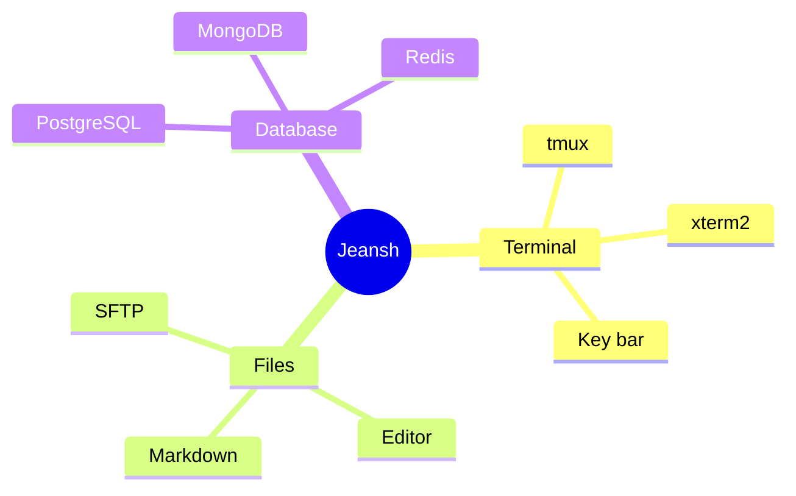

## Timeline — 9.4

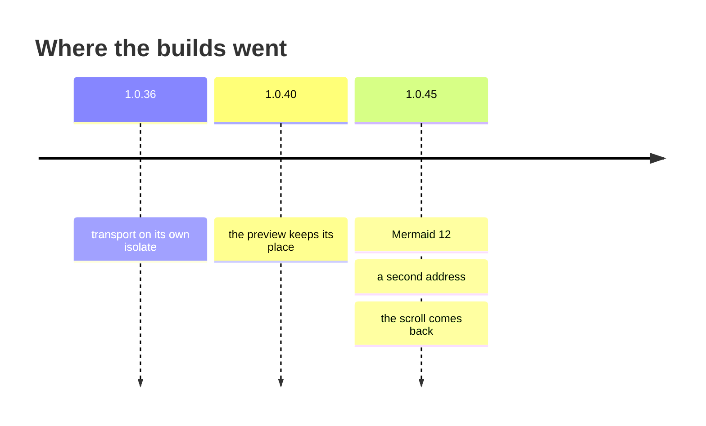

## Quadrant chart — 9.4

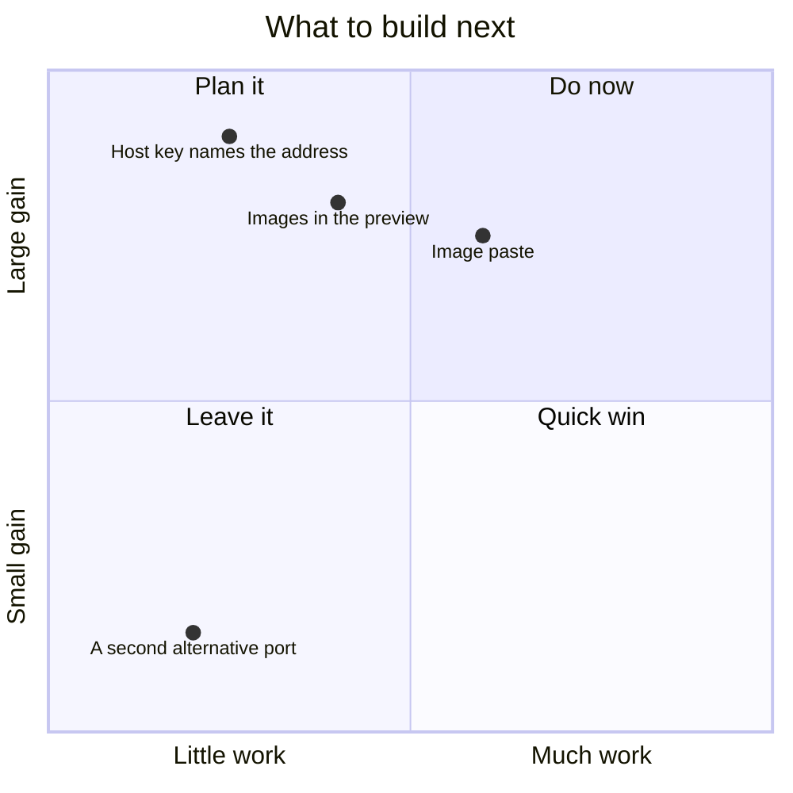

## Sankey — 10.3

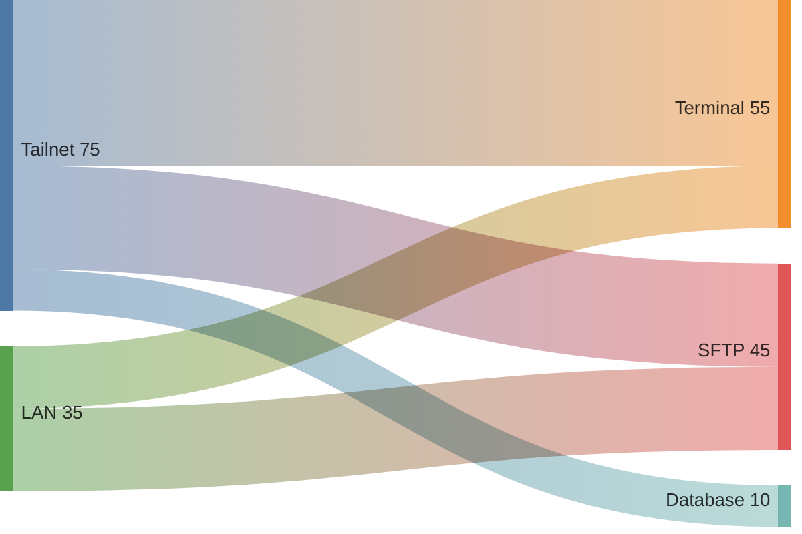

## XY chart — 10.3

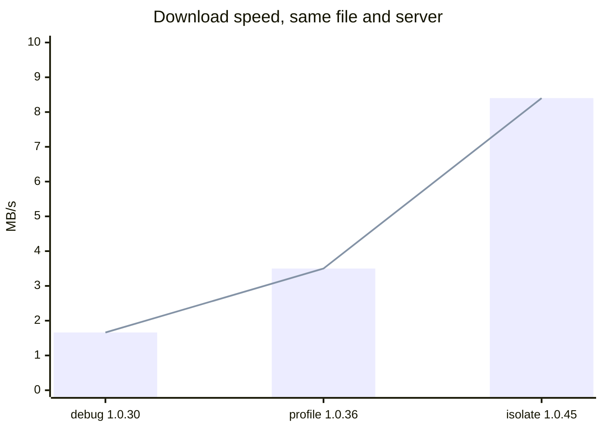

## Block — 10.9

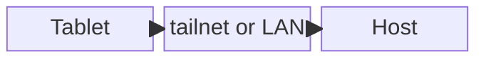

## Packet — 11.0

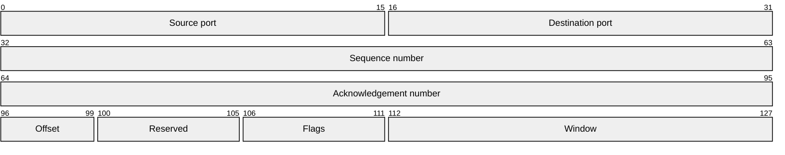

## Architecture — 11.1

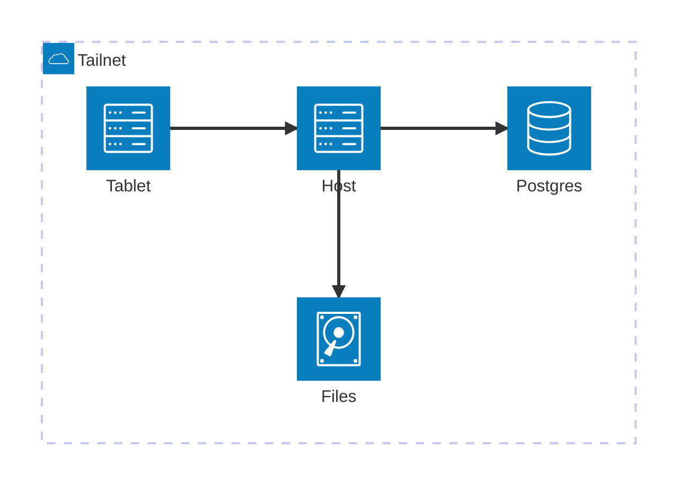

## Kanban — 11.3

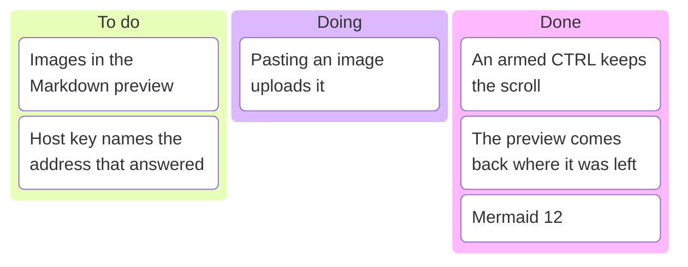

## Radar — 11.6

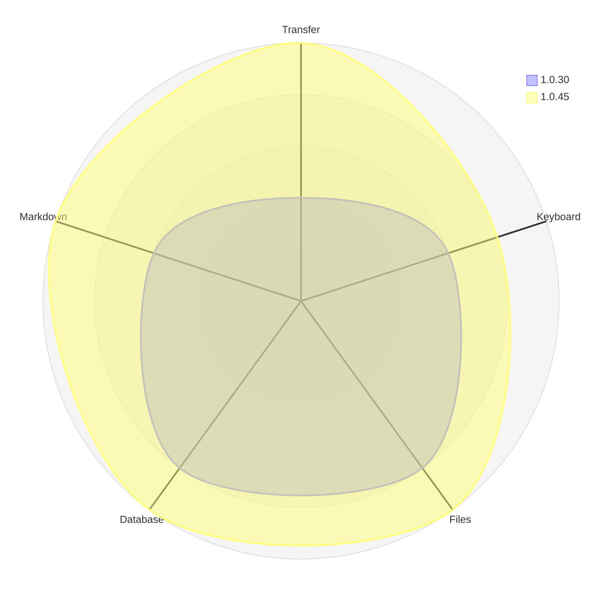

## Treemap — 11.6

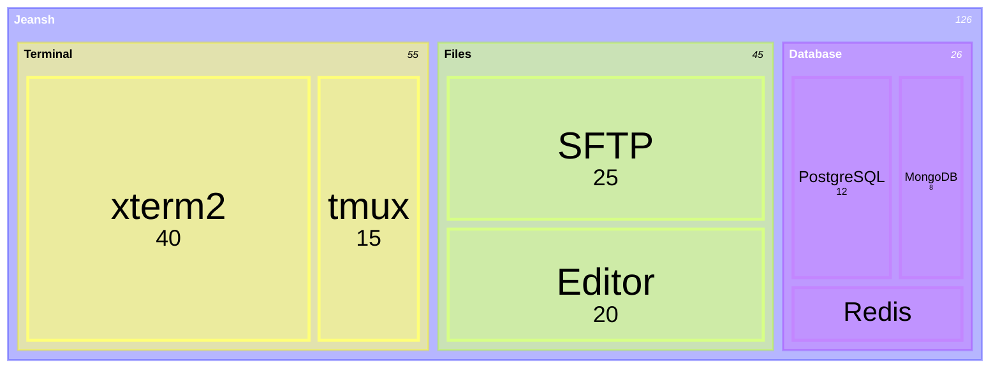

## The older kinds, for comparison

These were here before 10 and are drawn by ELK now, so they are worth a look
too — this is where a layout change shows most.

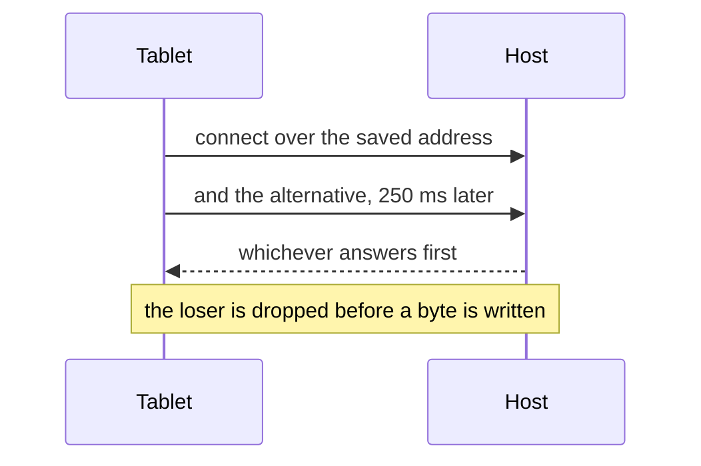

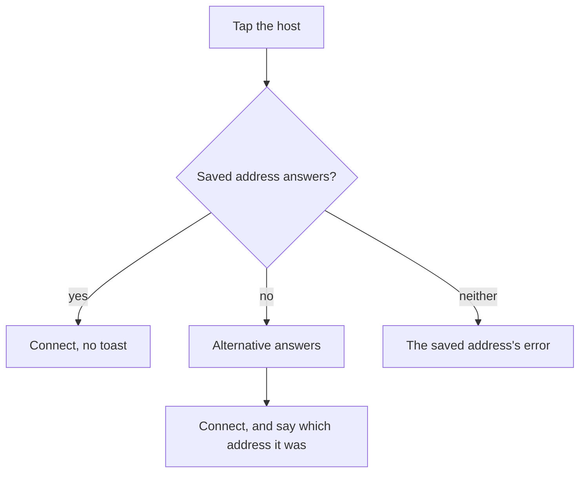

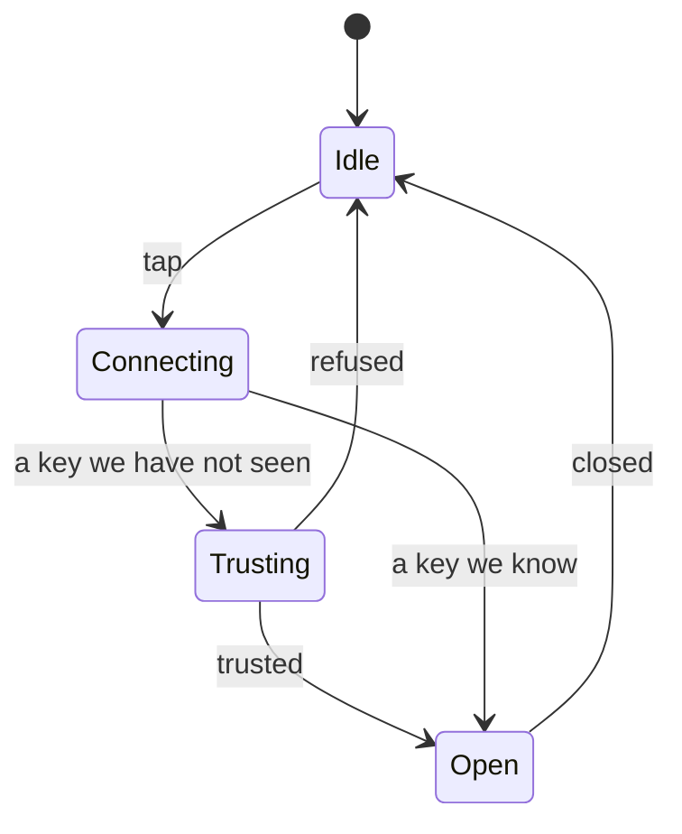
