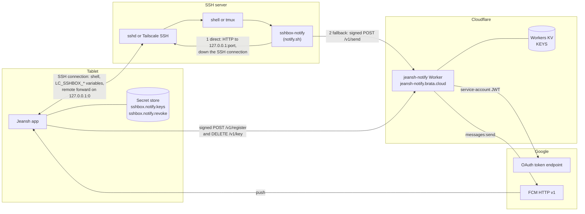
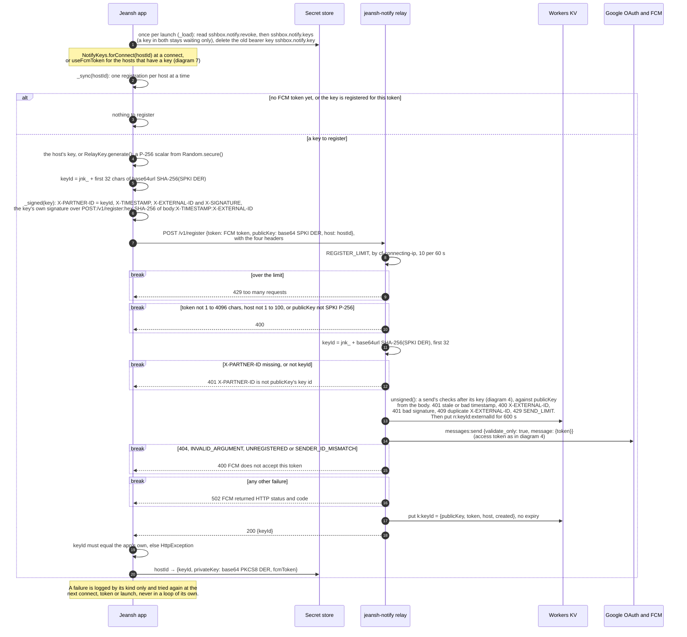
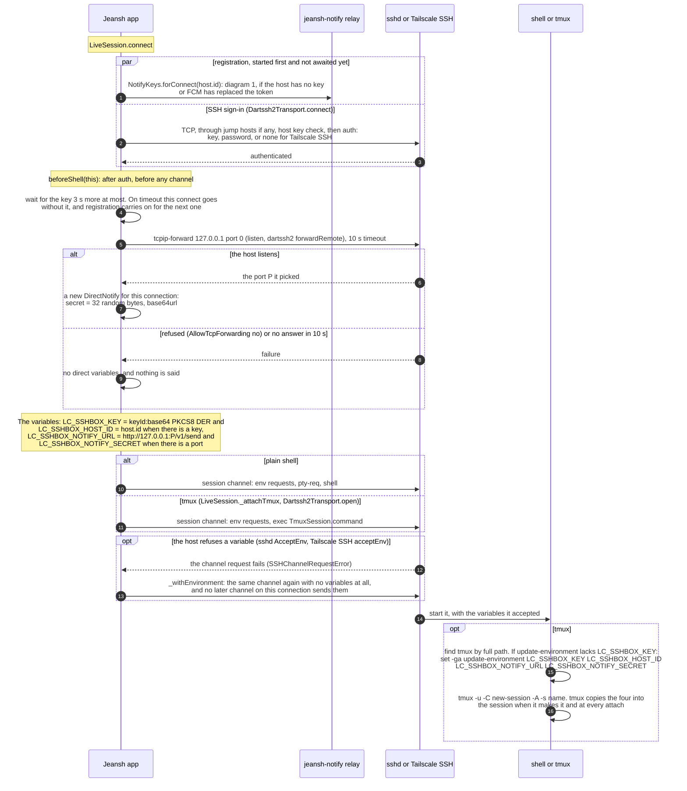
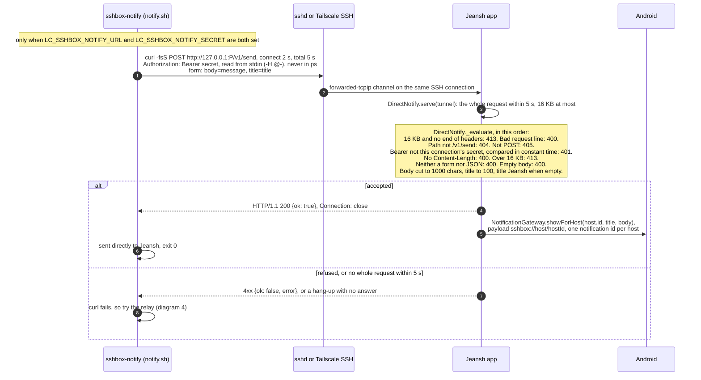
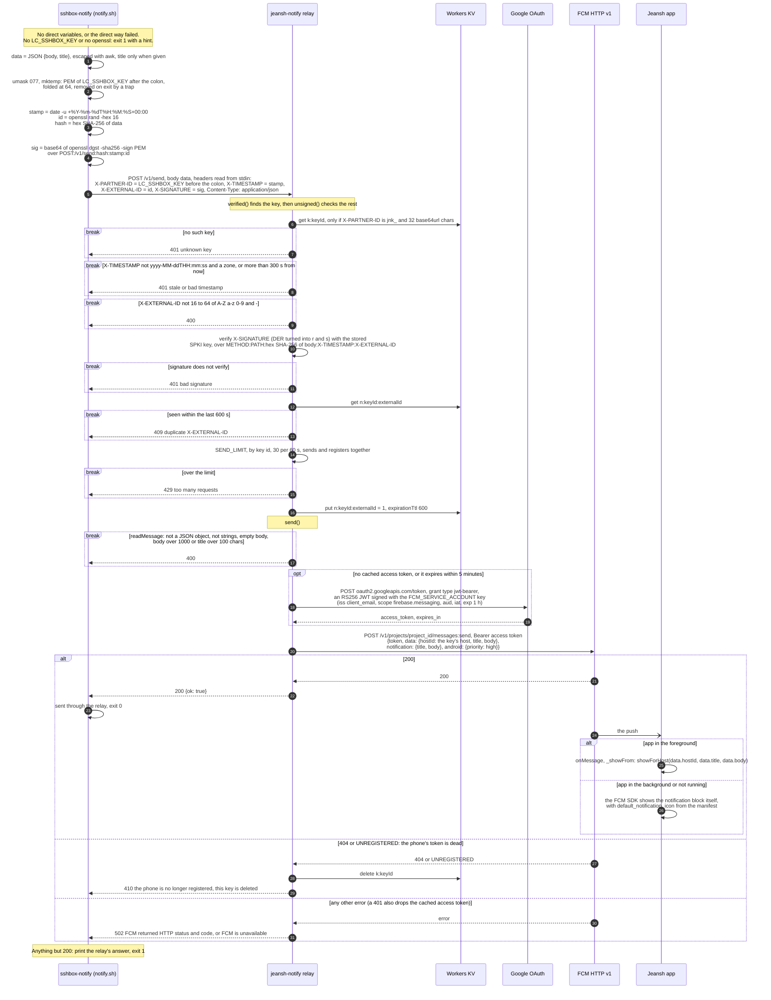
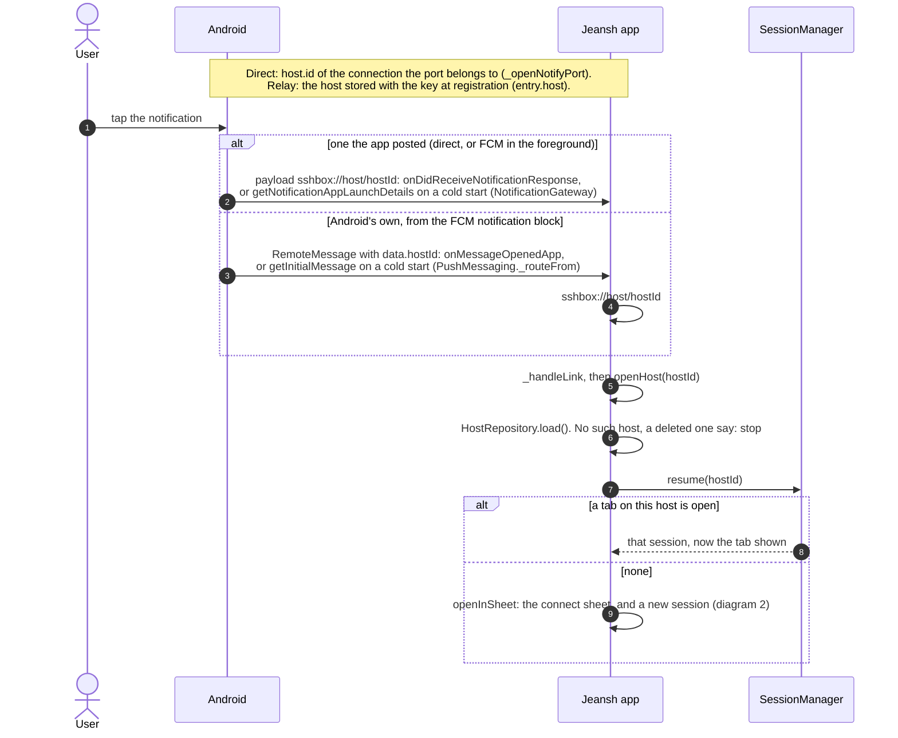
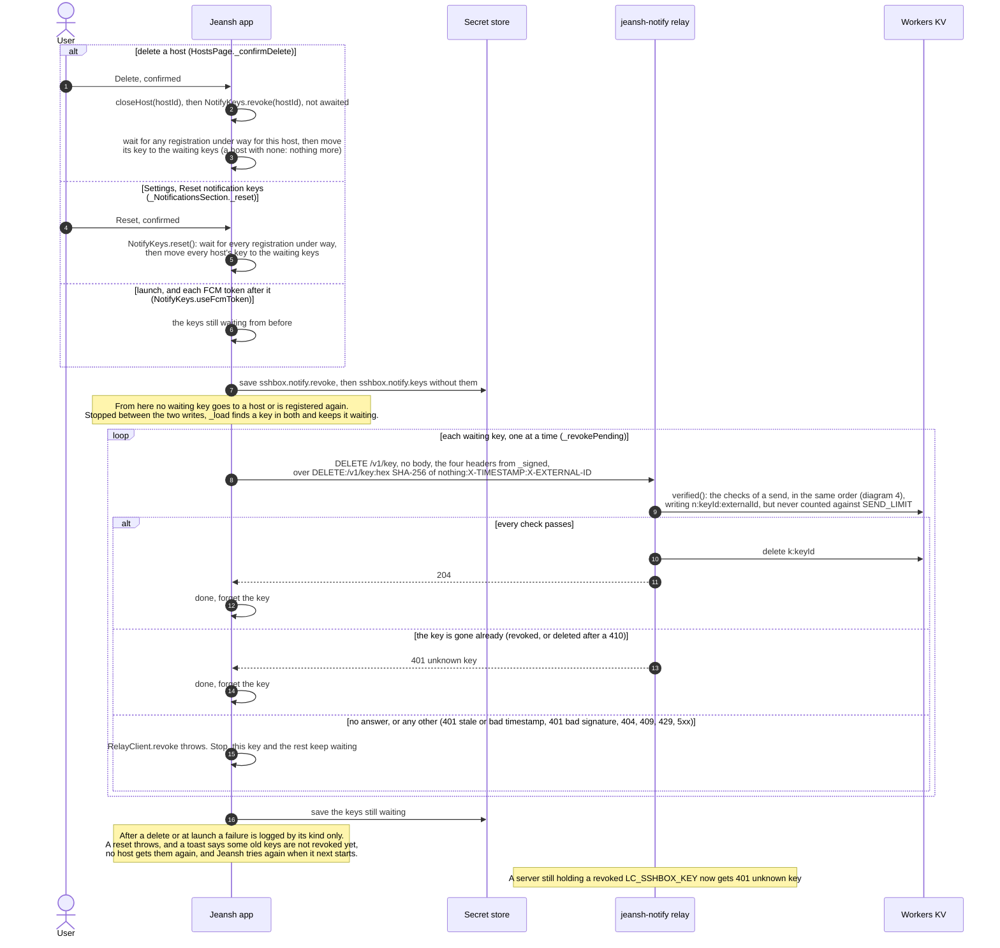
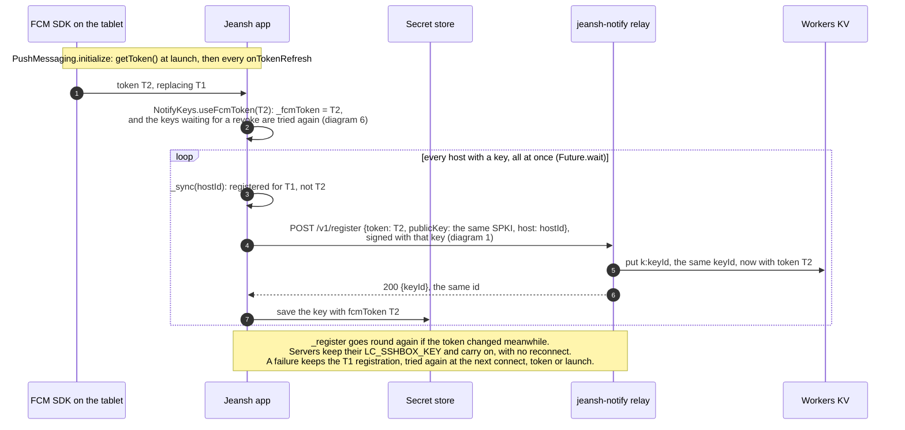

# Notification architecture

How a server puts a notification on the tablet. There are two ways, and
`sshbox-notify` tries them in this order:

1. **Direct**: an HTTP request to a port on the server's loopback, which comes
   straight down the open SSH connection to the app. No FCM, no relay.
2. **Relay**: a request signed SNAP-style with the host's own key, sent to the
   jeansh-notify Cloudflare Worker, which pushes it through FCM. It works with
   no session open.

The diagrams follow the app's code as of this file's last change, and
jeansh-notify `a686159`. Paths that start with `relay:` are in
[jeansh-notify](https://github.com/triasbrata/jeansh-notify); the rest are in
this repo.

## Components

| Where | Holds | Code |
|---|---|---|
| App, secret store `sshbox.notify.keys` | for each host id: the key id, the P-256 private key (PKCS#8 DER, base64) and the FCM token it is registered for | `NotifyKeys._save`, `lib/src/notifications/notify_key.dart` |
| App, secret store `sshbox.notify.revoke` | the keys dropped with their host or by a reset whose revoke the relay has not confirmed: key id → PKCS#8 DER, base64. None goes to a host again | `NotifyKeys._save`, `_revokePending` |
| App, memory only | FCM's current token; each connection's direct secret | `NotifyKeys._fcmToken`; `DirectNotify.secret`, `lib/src/notifications/direct_notify.dart` |
| Server, the shell's environment | `LC_SSHBOX_KEY` = `<keyId>:<base64 PKCS#8>`, `LC_SSHBOX_HOST_ID`, `LC_SSHBOX_NOTIFY_URL`, `LC_SSHBOX_NOTIFY_SECRET` | `LiveSession.connect`, `lib/src/session/session_manager.dart` |
| Server, during one relay send | the key as a PEM file, created under `umask 077` and deleted on exit | `relay: notify.sh` |
| Relay, Worker secret `FCM_SERVICE_ACCOUNT` | the Firebase service account JSON with its RSA key; the access token it buys, cached until 5 minutes before it expires | `accessToken`, `relay: src/index.ts` |
| Relay, Workers KV `KEYS` | `k:<keyId>` → `{publicKey, token, host, created}`; `n:<keyId>:<X-EXTERNAL-ID>` → `"1"` for 600 s, for every register, send and revoke let through | `register`, `unsigned`, `relay: src/index.ts` |
| Google | the device's FCM registration behind the token | — |

## 1. Per-host key registration

A host gets its key pair at its first connect once FCM has given the app a
token. Only the public half leaves the phone, in a request signed with the
private half, so only a holder of the key can point it at a phone.

Code: `lib/src/notifications/notify_key.dart` (`NotifyKeys.forConnect`,
`_sync`, `_register`, `_save`, `_load`; `RelayKey.generate`, `spki`, `id`,
`sign`; `_signed`; `RelayClient.register`), `relay: src/index.ts` (`register`,
`unsigned`, `fcm`), `relay: wrangler.jsonc` (`REGISTER_LIMIT`, `SEND_LIMIT`).

## 2. Connect

Registration runs alongside SSH sign-in. The shell waits for it 3 s at most.
The direct port is asked for on every connection, before any shell or tmux.

A refused variable drops all four, the direct pair too. Such a server can
still be given `LC_SSHBOX_KEY` by hand, from **Copy notification key** on the
host's edit page (`lib/src/ui/host_edit_page.dart`, `_copyNotifyKey`). When
tmux turns out to be missing, the connection is closed and a plain-shell
connect runs this diagram again.

Code: `lib/src/session/session_manager.dart` (`LiveSession.connect`,
`_openNotifyPort`, `_attachTmux`), `lib/src/session/dartssh2_transport.dart`
(`connect`, `listen`, `open`, `_withEnvironment`), `lib/src/session/tmux.dart`
(`TmuxSession.command`).

## 3. Sending the direct way

Code: `relay: notify.sh`, `lib/src/notifications/direct_notify.dart`
(`serve`, `_evaluate`), `lib/src/session/session_manager.dart`
(`_openNotifyPort`), `lib/src/notifications/notification_gateway.dart`
(`showForHost`).

## 4. Sending through the relay

The fallback. The request is signed the way Indonesia's SNAP payment API signs
one, and the relay checks it in exactly this order.

Code: `relay: notify.sh`, `relay: src/index.ts` (`send`, `verified`,
`unsigned`, `verify`, `derToRaw`, `readMessage`, `fcm`, `accessToken`, `signJwt`),
`relay: wrangler.jsonc` (`SEND_LIMIT`), `lib/src/notifications/push_messaging.dart`
(`_showFrom`).

## 5. Tap to open

The host a tap opens is fixed before any message exists. A send's body gives
only a title and a body.

Code: `lib/src/notifications/notification_gateway.dart`,
`lib/src/notifications/push_messaging.dart` (`_routeFrom`), `lib/src/app.dart`
(`_handleLink`, `openHost`), `lib/src/session/session_manager.dart`
(`SessionManager.resume`), `relay: src/index.ts` (`send` takes `host` from the
key's entry).

## 6. Revoke

A key leaves every host the moment it is dropped. It then waits in
`sshbox.notify.revoke`, never registered again, until the relay confirms the
revoke.

After a reset each host gets a new key pair at its next connect (diagram 1).

Code: `lib/src/ui/hosts_page.dart` (`_confirmDelete`),
`lib/src/ui/settings_page.dart` (`_NotificationsSection._reset`),
`lib/src/notifications/notify_key.dart` (`NotifyKeys.revoke`, `reset`,
`useFcmToken`, `_revokePending`, `_retryRevokes`, `_save`, `_load`;
`RelayClient.revoke`, `_signed`), `relay: src/index.ts` (`revoke`,
`verified`, `unsigned`).

## 7. FCM token refresh

Code: `lib/src/notifications/push_messaging.dart` (`initialize`),
`lib/src/notifications/notify_key.dart` (`NotifyKeys.useFcmToken`, `_register`,
`_retryRevokes`).

## Security properties

- **A push goes only to the phone that registered its key.** The relay sends
  to the FCM token stored with the key, and only a request signed with that
  key's private half can store or change it: the phone, and that host's
  servers, which are given the key to sign their sends.
- **A leaked relay KV** gives public keys, FCM tokens, host ids and recent
  external ids. It holds no private key and no Firebase credential (that is a
  Worker secret), so nothing in it can sign a send, register a key again, or
  push to a phone.
- **A compromised server** holds its own host's private key, and the direct
  secret of each of its connections while that connection lasts. It can
  notify this phone as its own host, at most 30 a minute through the relay:
  the relay takes the host from the key, and the direct handler from the
  connection. It never sees the phone's FCM token, and nothing listens on the
  phone. It can also register its key again, which moves that one key only:
  to another FCM token, a Jeansh install of its own, which then gets this
  host's relay pushes instead of this phone, or to another host id, which a
  tap then opens. No other host's key or pushes. Deleting the host, or a
  reset, revokes the key and ends it.
- **Replay protection** covers a signed request sent again. Within the 300 s
  window the `n:` record, kept for 600 s, answers 409; after the window the
  timestamp answers 401. The signature binds method, path, body hash, time
  and external id, so a captured send can't come back as a `DELETE` or with
  another body, and a captured register can't come back with another token,
  nor bring back a key revoked since. The direct way has no replay check: its
  secret stays on one server, for one connection.
- **A revoke holds.** A key dropped with its host or by a reset goes to no
  host from that moment, and waits in `sshbox.notify.revoke` until the relay
  answers 204, or 401 `unknown key` for a key it has no more. Anything else,
  a relay out of reach or a phone clock more than 5 minutes off (401 `stale
  or bad timestamp`) included, keeps it waiting for the next launch, delete
  or reset. A revoke is never rate-limited, so a server sending at its key's
  limit can't hold off its own revoke.
- **Closed** by the signed register and the reliable revoke (jeansh-notify
  `a686159` and the app change alongside it):
  - `POST /v1/register` took a public key with no signature, so anyone holding
    one, from a leaked KV or worked out from a server's private key, could
    register it with the FCM token of their own Jeansh install and get that
    host's pushes. A register is now signed with the key it registers, and an
    unsigned one is refused.
  - Deleting a host dropped its key before the relay confirmed the revoke, so
    a relay out of reach left the key live for good, and `RelayClient.revoke`
    took every 401 (a stale phone clock too) and a 404 as done. Now only 204
    or 401 `unknown key` is done, and anything else waits and is tried again.
- **Known limits:**
  - Whoever holds a host's private key, that is its servers, can still
    re-bind that one key to another token or host id, as under a compromised
    server. From the relay's `ponytail:` note: a device key of the app's own,
    never handed to a server, signing registers instead would close that.
  - KV is eventually consistent, so a replay that lands on another Cloudflare
    location within about a minute may pass. A Durable Object would make the
    check strict (also a `ponytail:` note).
  - A waiting key lost with an unreadable secret store stays live until FCM
    retires the phone's token.
  - Registering now needs the phone's clock within 5 minutes of the relay's,
    as a revoke always did. A register refused for it is tried again at the
    next connect or token.
- **The KV write quota:** Cloudflare's free plan allows 1,000 KV writes a day,
  and 1,000 deletes. Each accepted send, register or revoke writes an `n:`
  record, and each registration a `k:` record too, so the relay handles about
  1,000 of those a day for all users together. Past that, `put` throws and the
  request fails. One key sending at its 30-a-minute limit uses up the day in
  about half an hour.

## Where each piece lives

- `lib/src/notifications/notify_key.dart`: the relay address; `RelayKey` (the
  P-256 pair, SPKI and PKCS#8, key id, signing); `_signed` (the SNAP headers
  on both calls); `RelayClient` (register, revoke, and `exchange`, the HTTP a
  test's `FakeRelay` stands in for); `NotifyKeys` (keys per host, stored,
  registered, revoked, reset, and the keys waiting for a revoke).
- `lib/src/notifications/direct_notify.dart`: `DirectNotify`, the HTTP handler
  and secret for one connection.
- `lib/src/notifications/push_messaging.dart`: FCM tokens to `NotifyKeys`, a
  push shown in the foreground, a tap routed.
- `lib/src/notifications/notification_gateway.dart`: local notifications with
  the `sshbox://host/<hostId>` payload, and their taps.
- `lib/src/session/session_manager.dart`: `LiveSession.connect` builds the
  variables and `_openNotifyPort` asks for the port; `SessionManager.resume`.
- `lib/src/session/dartssh2_transport.dart`: `beforeShell` after auth, `listen`
  (the remote forward), `_withEnvironment` (the retry without variables).
- `lib/src/session/tmux.dart`: `TmuxSession.command` and `update-environment`.
- `lib/src/ui/hosts_page.dart`: deleting a host revokes its key, until the
  relay confirms.
- `lib/src/ui/host_edit_page.dart`: Copy notification key.
- `lib/src/ui/settings_page.dart`: Reset notification keys.
- `lib/src/app.dart`: the wiring, `_handleLink` and `openHost`.
- `relay: src/index.ts`: the Worker: `register`, `send`, `revoke`, `verified`,
  `unsigned`, `fcm`, `accessToken`, `signJwt`.
- `relay: wrangler.jsonc`: the route, the KV binding and both rate limits.
- `relay: notify.sh`: `sshbox-notify`, direct first, then the relay.
